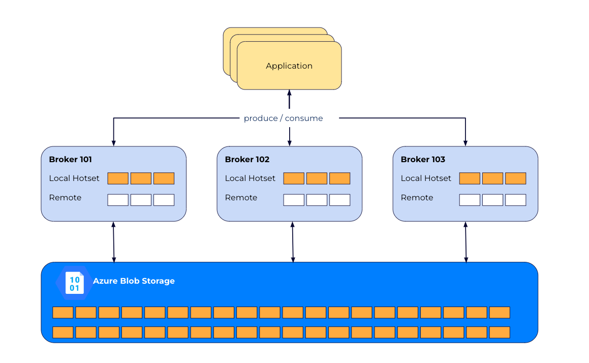
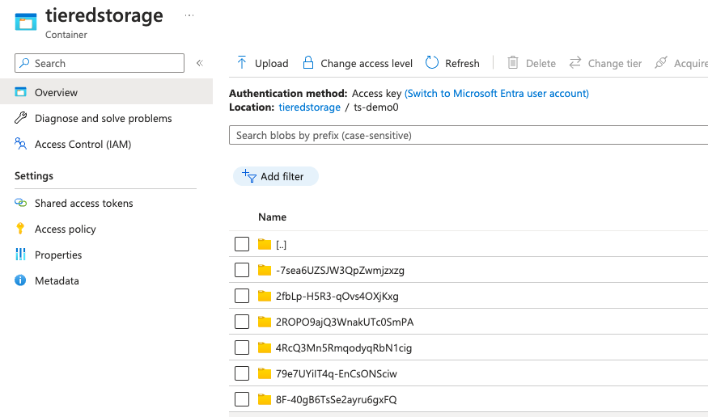

# CP Tiered Storage



## Resources
* [Tiered Storage](https://docs.confluent.io/platform/current/kafka/tiered-storage.html#aws)

## Blob Storage
1. Create a Storage account and get the connection string (under Access Keys).
2. Under Containers, we create a `tiereddemo` container.


## Brokers

We mount a credentials file containing the `connectionString` into the container and
we add to the broker configuration: its path:

```yaml
KAFKA_CONFLUENT_TIER_FEATURE: "true"
KAFKA_CONFLUENT_TIER_METADATA_REPLICATION_FACTOR: 1
KAFKA_CONFLUENT_TIER_TOPIC_DELETE_CHECK_INTERVAL: 60000
## Azure Blob Storage
KAFKA_CONFLUENT_TIER_BACKEND: AzureBlockBlob
KAFKA_CONFLUENT_TIER_AZURE_BLOCK_BLOB_CONTAINER: "tiereddemo"
KAFKA_CONFLUENT_TIER_AZURE_BLOCK_BLOB_PREFIX: "ts-demo"
KAFKA_CONFLUENT_TIER_AZURE_BLOCK_BLOB_CRED_FILE_PATH: /home/appuser/creds.json
```

The file `creds.json`you should create with this format (replace your account name and your key):

```
{
    "connectionString": "DefaultEndpointsProtocol=https;AccountName=YOUR_ACCOUNT_NAME;AccountKey=YOUR_KEY;EndpointSuffix=core.windows.net"
  }
```

You can start:

```shell
docker compose up -d 
```

## Create topic
```shell
kafka-topics --bootstrap-server localhost:9092   \
  --create --topic test-topic \
  --partitions 1 \
  --replication-factor 1 \
  --config confluent.tier.enable=true \
  --config confluent.tier.local.hotset.ms=30000 \
  --config segment.bytes=2000000
```

## Produce
```shell
kafka-producer-perf-test \
   --producer-props bootstrap.servers=localhost:9092 \
   --topic test-topic \
   --record-size 1000 \
   --throughput 1000 \
   --num-records 3600000
```

## Verify Tiered Storage




## Consume
```shell
kafka-console-consumer \
  --bootstrap-server localhost:9092 \
  --topic test-topic \
  --from-beginning      
```

# Clean up

```shell
docker compose down -v    
```